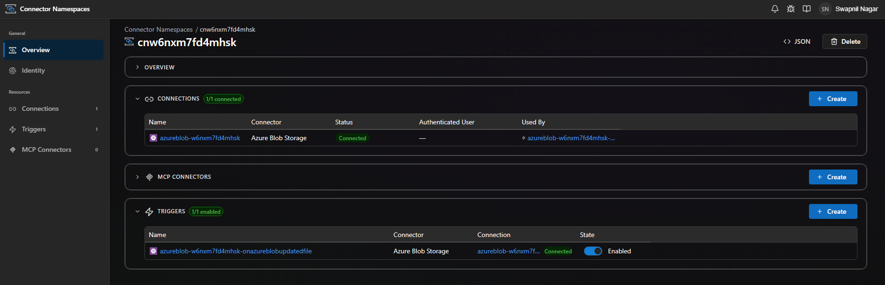

# azureblobApp

Azure Functions sample app demonstrating the **Azure Blob Storage** connector triggers from
[`@azure/functions-extensions-connectors`](https://www.npmjs.com/package/@azure/functions-extensions-connectors).

## Triggers included

| Function | Connector operation | Description |
| --- | --- | --- |
| `OnAzureBlobUpdatedFile` | `OnUpdatedFiles_V2` | Fires when a blob is added or modified (properties only) (V2) in the configured container — see [Microsoft Learn](https://learn.microsoft.com/en-us/connectors/azureblob/#when-a-blob-is-added-or-modified-(properties-only)-(v2)) |

## Run locally

```sh
npm install
npm start
```

Update `local.settings.json` with your connector runtime URL and access token before starting.

## Deploy to Azure

`azd up` will provision:

- A Flex Consumption Function App (Node 20)
- A Storage account, Application Insights, Log Analytics
- A **Connector Namespace** (`Microsoft.Web/connectorGateways`) containing:
  - An **Azure Blob connection** (key-based auth)
  - One **trigger config** wired to the Functions trigger above

```sh
azd auth login
azd up
```

During the postdeploy step the script prompts for:

1. **Storage account name OR blob endpoint URL** — either the bare account
   name (e.g. `mystorage`) or the full blob endpoint (e.g.
   `https://mystorage.blob.core.windows.net/`). For V2 operations and Microsoft
   Entra / managed-identity auth you must enter the storage account name as a
   custom value (see the [connector docs](https://learn.microsoft.com/en-us/connectors/azureblob/#general-known-issues-and-limitations)).
2. **Storage account access key** — read as a secret; not persisted to azd
   environment values.
3. **Container name** to watch (e.g. `samples`). The script encodes this as
   the connector's `folderId` (base64 of `%2F<container>`).

The non-secret values (account name + container) are persisted via
`azd env set BLOB_ACCOUNT` / `BLOB_CONTAINER` so subsequent runs offer them
as defaults. The access key is always re-prompted.

After provisioning, an `azd` postdeploy hook
(`infra/scripts/postdeploy.ps1` / `.sh`) uses the
[`connector-namespace`](https://github.com/Azure/Connectors) Azure CLI extension to:

1. PUT the Azure Blob connection's `keyBasedAuth` parameter values
   (`accountName`, `accessKey`) via ARM REST and wait until the connection
   flips to `Connected`.
2. Create one **trigger config** (`OnUpdatedFiles_V2`) bound to the Azure
   Blob connection and parameterized with the chosen `dataset` and
   `folderId`.

The Bash script requires `jq`. The PowerShell script requires PowerShell 7+ (`pwsh`).

> Connector Namespace currently requires the `brazilsouth` region (the only
> region with the required preview features as of writing). Override via
> `azd env set CONNECTOR_NAMESPACE_LOCATION <region>` if needed.

To re-run only the post-deployment configuration without redeploying code:

```sh
azd hooks run postup
```

The connector trigger requires the **Preview** Functions Extension Bundle
(`Microsoft.Azure.Functions.ExtensionBundle.Preview`). This is already configured in `host.json`.

## Verify the Connector Namespace, connection, and triggers

After `azd up` finishes, open the **Connector Namespaces** portal to verify
the resource was provisioned and that the trigger is wired to a `Connected`
Azure Blob connection:

[Connectors — Connector Namespaces](https://connectors.azure.com/)

You should see:

- One **Connection** (Azure Blob) with status **Connected**
- One **Trigger** (`OnUpdatedFiles_V2`) in **Enabled** state and bound
  to the connection above



If the trigger is not listed or the connection shows as `Unauthenticated`,
re-run `azd hooks run postup` and re-enter the storage account / access
key when prompted.

## Project layout

```
azureblobApp/
├── src/
│   ├── index.ts                   # app.setup({ enableHttpStream: true })
│   └── functions/                 # one file per trigger
├── infra/
│   ├── main.bicep                 # azd entrypoint (subscription scope)
│   ├── resources.bicep            # Storage + App Insights + Function App + Connector Namespace
│   ├── connectorNamespace.bicep   # Connector Namespace + Azure Blob connection + access policies
│   ├── main.parameters.json
│   └── scripts/
│       ├── postdeploy.ps1         # connection params + trigger config (Windows / pwsh)
│       └── postdeploy.sh          # connection params + trigger config (Linux / macOS)
├── azure.yaml
├── host.json
├── local.settings.json
├── package.json
└── tsconfig.json
```
