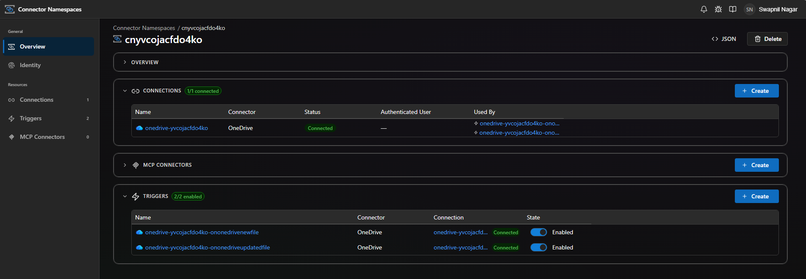

# onedriveApp

Azure Functions sample app demonstrating the **OneDrive** connector triggers from
[`@azure/functions-extensions-connectors`](https://www.npmjs.com/package/@azure/functions-extensions-connectors).

## Triggers included

| Function | Connector operation | Description |
| --- | --- | --- |
| `onOneDriveNewFile`     | `OnNewFileV2`     | Fires when a new file is created in the configured OneDrive folder |
| `onOneDriveUpdatedFile` | `OnUpdatedFileV2` | Fires when an existing file in the configured OneDrive folder is modified |

## Run locally

```sh
npm install
npm start
```

Update `local.settings.json` with your connector runtime URL and access token before starting.

## Deploy to Azure

`azd up` will provision:

- A Flex Consumption Function App (Node 20)
- A Storage account, Application Insights, Log Analytics
- A **Connector Namespace** (`Microsoft.Web/connectorGateways`) containing:
  - A **OneDrive for Business connection**
  - Two **trigger configs**, one per Functions trigger above, each routed to
    the corresponding function's connector webhook URL

```sh
azd auth login
azd up
```

During the postdeploy step, the script first authorizes the OneDrive
connection (opens an OAuth consent page in your browser and polls until the
connection flips to `Connected`). It then launches an interactive folder
picker that lists your OneDrive folders **through the authorized
connection** — letting you drill into subfolders and pick the one to watch.
The chosen folder id is persisted via `azd env set ONEDRIVE_FOLDER_ID` so
subsequent runs are non-interactive.

To skip the prompt (e.g. for CI), set it ahead of time. The value must be
the OneDrive connector's folder id (`root` for the drive root, otherwise
the `Id` returned by the connector's `/datasets/default/folders` endpoint —
e.g. `B47BB3F326DE0225!289` for personal accounts or a GUID for work):

```sh
azd env set ONEDRIVE_FOLDER_ID "root"
```

After provisioning, an `azd` postdeploy hook
(`infra/scripts/postdeploy.ps1` / `.sh`) uses the
[`connector-namespace`](https://github.com/Azure/Connectors) Azure CLI extension to:

1. Ensure the OneDrive connection exists and grant your user + the function
   app's managed identity access to it.
2. Walk you through **OAuth consent** by opening the consent link in your
   browser and polling until the connection flips to `Connected`.
3. Show an interactive folder picker (powered by
   `az connector-namespace connection invoke`, so it works even when the
   Azure CLI's own Graph token lacks `Files.Read` consent in your tenant).
4. Create one **trigger config** per Functions trigger (`OnNewFileV2` /
   `OnUpdatedFileV2`), each bound to the OneDrive connection and
   parameterized with `ONEDRIVE_FOLDER_ID`.

The Bash script requires `jq`. The PowerShell script requires PowerShell 7+ (`pwsh`).

> Connector Namespace currently requires the `brazilsouth` region (the only
> region with the required preview features as of writing). Override via
> `azd env set CONNECTOR_NAMESPACE_LOCATION <region>` if needed.

To re-run only the post-deployment configuration without redeploying code:

```sh
azd hooks run postdeploy
```

The connector trigger requires the **Preview** Functions Extension Bundle
(`Microsoft.Azure.Functions.ExtensionBundle.Preview`). This is already configured in `host.json`.

## Verify the Connector Namespace, connection, and triggers

After `azd up` finishes, open the **Connector Namespaces** portal to verify
the resource was provisioned and that both triggers are wired to a
`Connected` OneDrive connection:

[Connectors — Connector Namespaces](https://connectors.azure.com/)

You should see:

- One **Connection** (OneDrive) with status **Connected**
- Two **Triggers** (one per function), each in **Enabled** state and bound
  to the connection above

  

If a trigger is not listed or the connection shows as `Unauthenticated`,
re-run `azd hooks run postdeploy` and complete the consent flow when prompted.

## Project layout

```
onedriveApp/
├── src/
│   ├── index.ts                   # app.setup({ enableHttpStream: true })
│   └── functions/                 # one file per trigger
├── infra/
│   ├── main.bicep                 # azd entrypoint (subscription scope)
│   ├── resources.bicep            # Storage + App Insights + Function App + Connector Namespace
│   ├── connectorNamespace.bicep   # Connector Namespace + OneDrive connection + access policies
│   ├── main.parameters.json
│   └── scripts/
│       ├── postdeploy.ps1         # OAuth consent + trigger config (Windows / pwsh)
│       └── postdeploy.sh          # OAuth consent + trigger config (Linux / macOS)
├── azure.yaml
├── host.json
├── local.settings.json
├── package.json
└── tsconfig.json
```
